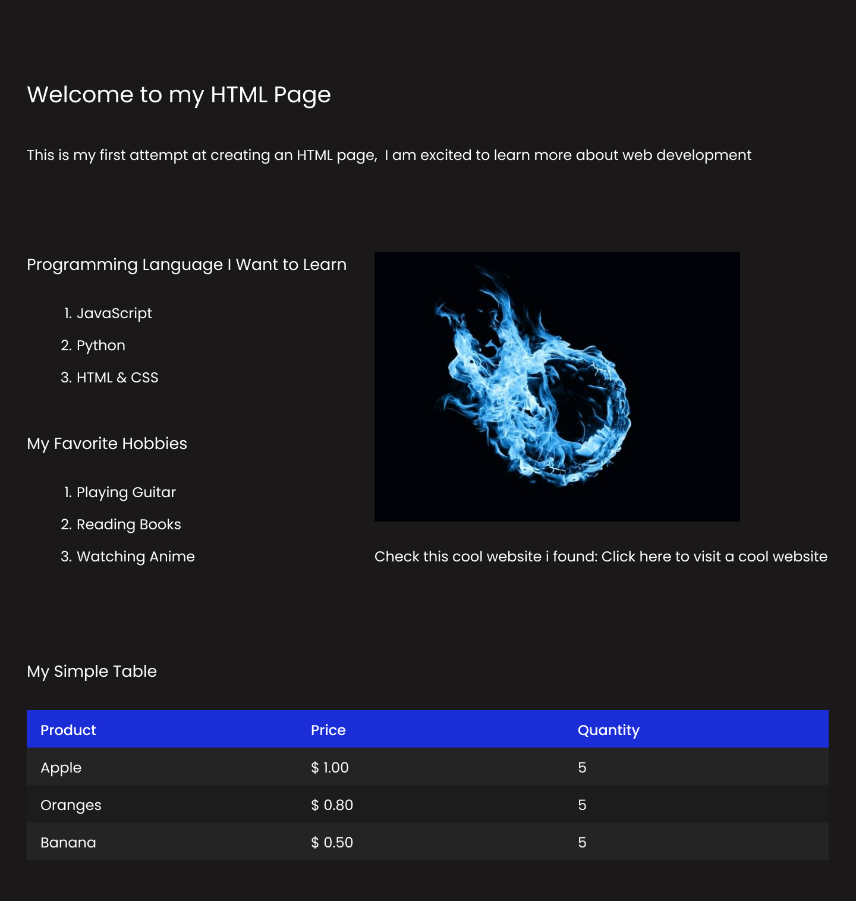
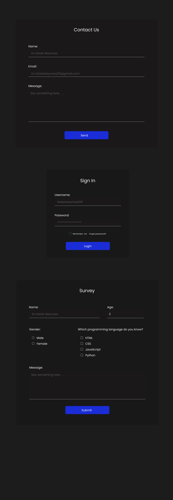

# Icreates_internship

<h3>What i have learn?</h3>
Within this learning experience, I have gained knowledge about creating headings, paragraphs, lists (ordered and unordered), images, and hyperlinks within a web page. Applying styles to these elements using CSS has allowed me to enhance the appearance and layout of the page. This newfound understanding of HTML and CSS has provided me with a solid foundation for creating and designing basic web pages. Moving forward, I am excited to delve into more advanced web development concepts.

<h5>Activity 1</h5>

<h5>Activity 2</h5>

